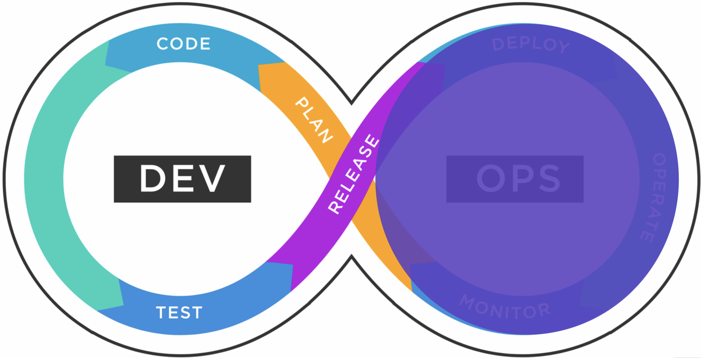
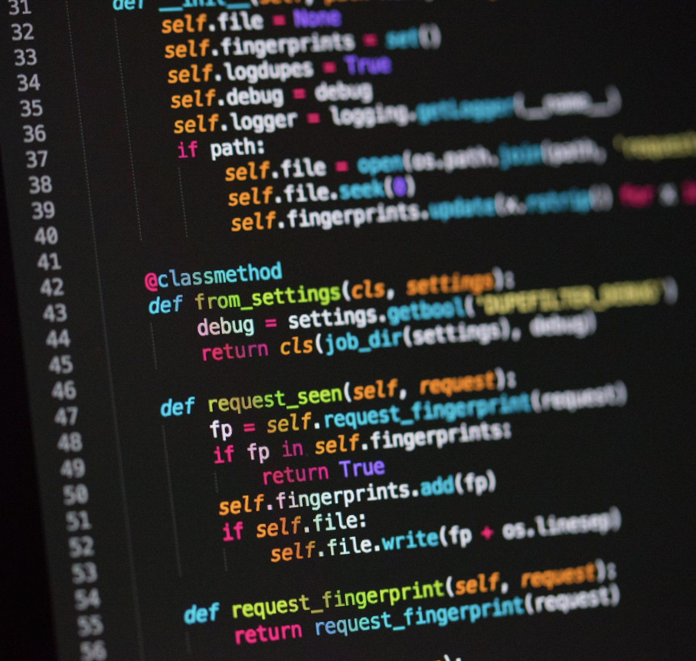
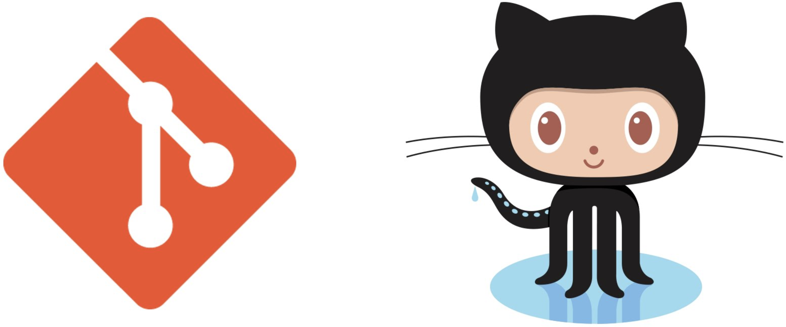
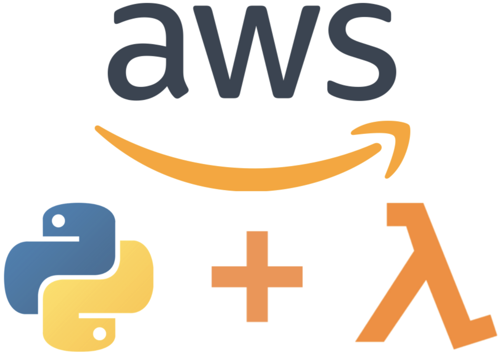
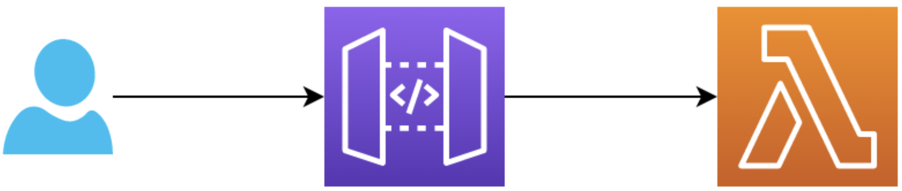
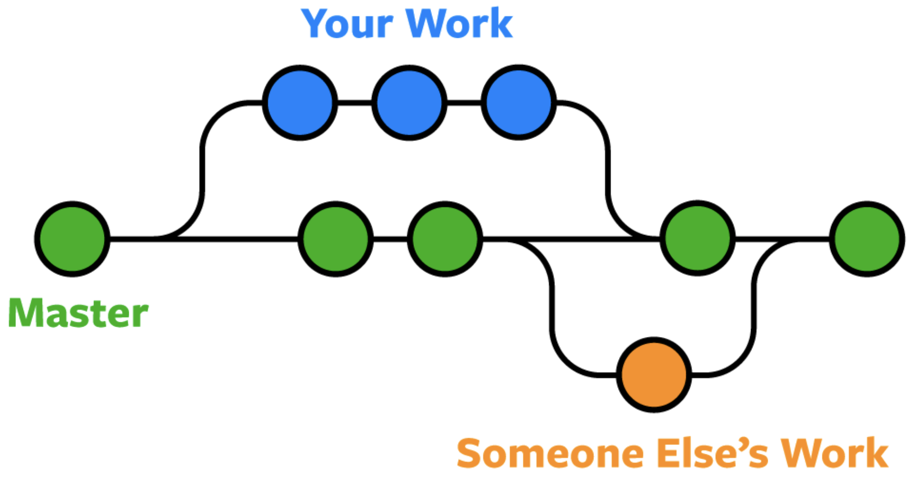
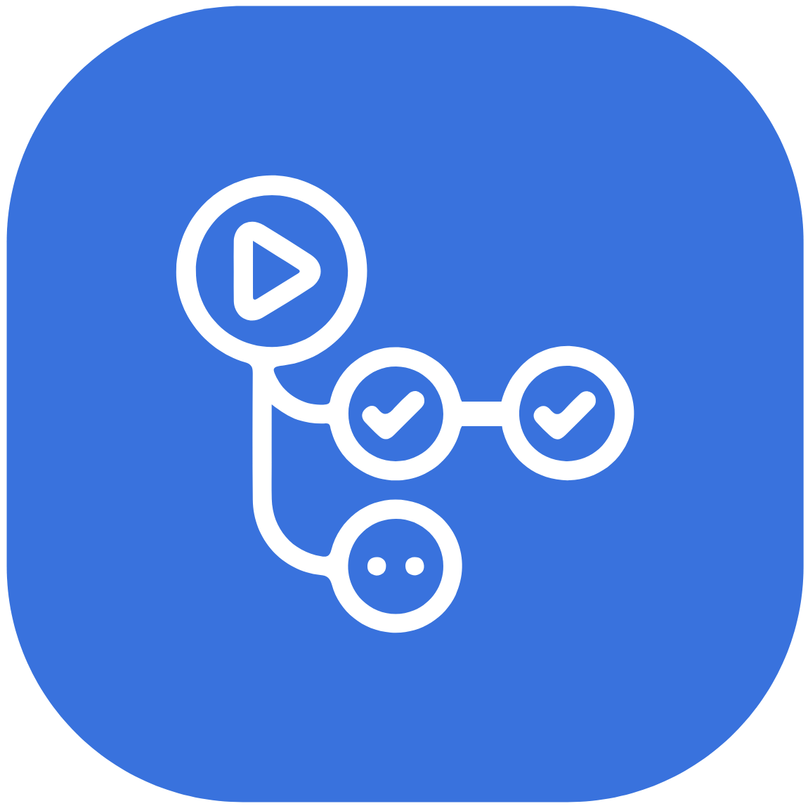

<!--
_class: invert
-->

# **Cloud and DevOps**

**Introduction to Software Development**

by Eduard Bargués

---

# **DevOps**

**Dev**elopment & **Op**eration**s**

---

# **Assemble your group**

👈 Unlike these guys,

**4 people** maximum

---

# **Local development**

> Code a function that receives an array of integers and returns an object containing the maximum, minimum and sum of the numbers. Include unit tests and execute them from your CLI.

[Follow along](https://realpython.com/python-testing/)

---

# **Repository**

> **Commit and push** the code to Github.

[Introduction to Git](https://www.freecodecamp.org/news/git-and-github-for-beginners/)

---

# **Lambda+Python**

> Get familiar with your code in AWS

- Create a _hello world_ lambda.
- Test it from the same UI.
- Paste your code in the lambda.
- Test it again.

---

# **Api**

> Connect your Lambda with APIGW

- Create a REST API via AWS' UI.
- Add a resource and method.
- Create a 'mock' integration.
- Test it.
- Conect the method with Lambda.
- Test it again.

---

# **Continous Integration**

> Methodology that allow developers to safely integrate their code. Answers the question: **Is my code ready to be released?**

---

# **CI: Branches & Pull requests**

> Developers separate their code in **branches** and use **pull requests**(PRs) to review their code.

---

# **CI: Github actions**

> Github provides a tool so developers can create workflows that are triggered by 12s of events.

Check out this [repository](https://github.com/EduardBargues/cicd-template).

---

# **CI: Testing**

> Create a workflow that triggers every time a pull request is updated. Execute the unit tests previously created as a job.

